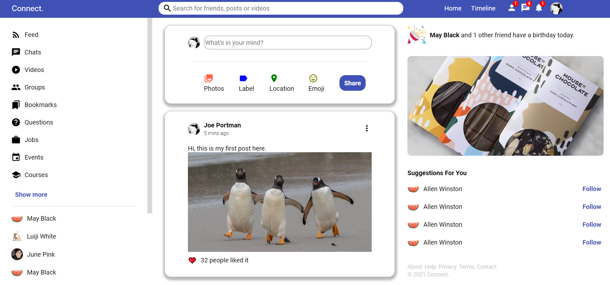

### Screenshot

&nbsp;

### To run in a local environment:

step 1: git clone 

step 2: cd [local repository]

step 3: npm install

step 4: npm start

I found this [post](https://stackoverflow.com/a/47137706/16779281) very useful
